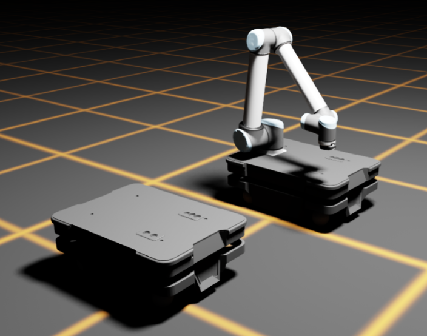

# Additive Manufacturing Automation

## 📌 Project Overview
This project is my **Master thesis**. It will utilize **Isaac Sim** and **ROS** to control a **MIR platform** with a mounted **UR10**. The goal is to create a system that can produce parts on demand. Initially, I will create a **digital twin** of the system, which will later be transferred to the real world.

This project is in very early stages, and I will update this README as I progress.

## 📬 Contact
📧 Email: damianb.xp@gmail.com  
🐙 [GitHub](https://github.com/damianbxp)  
