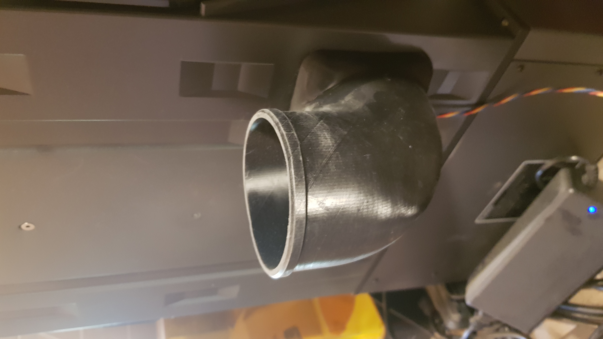
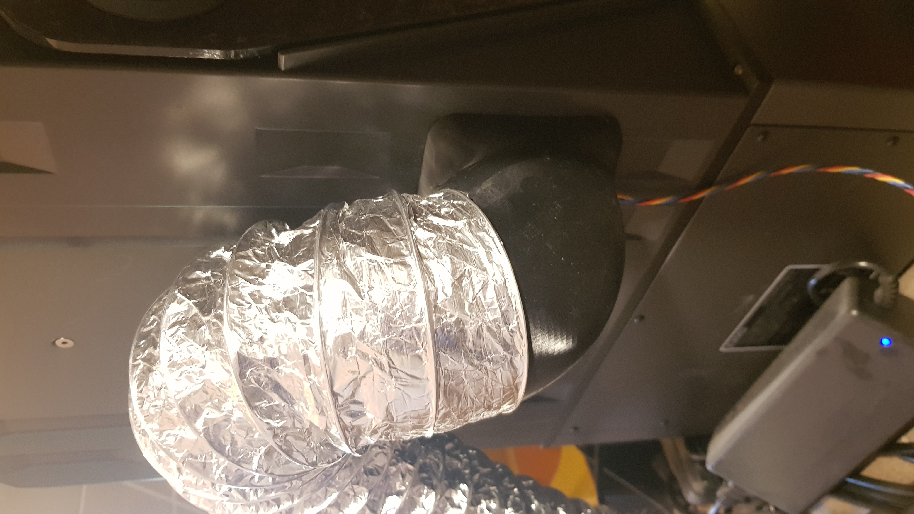
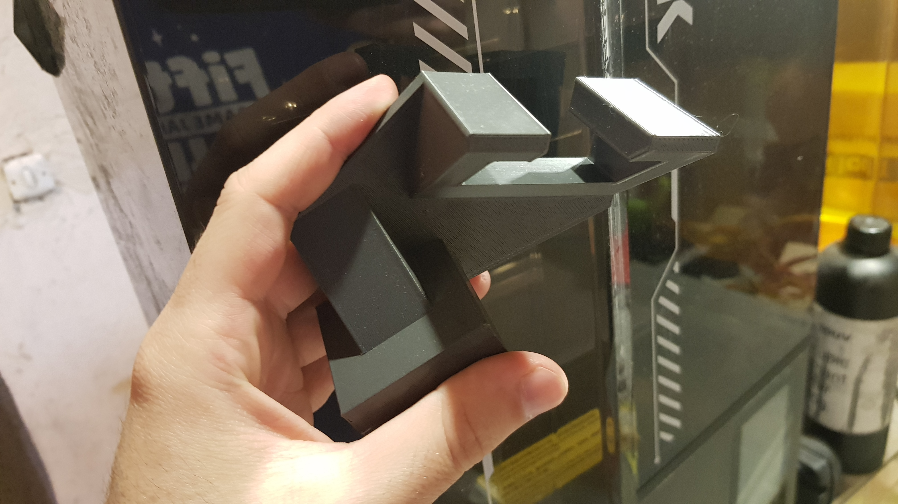
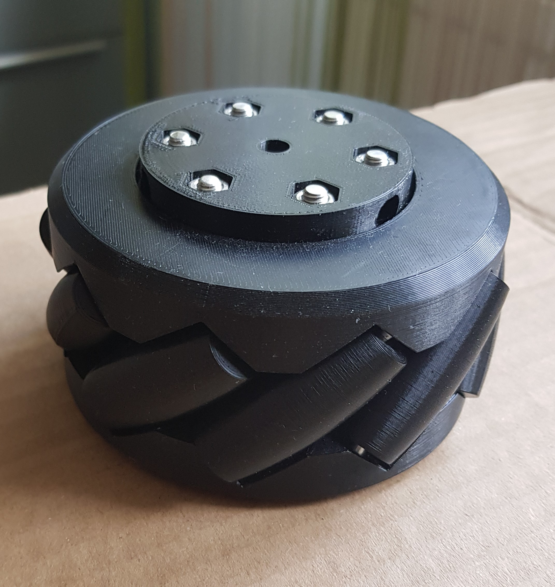
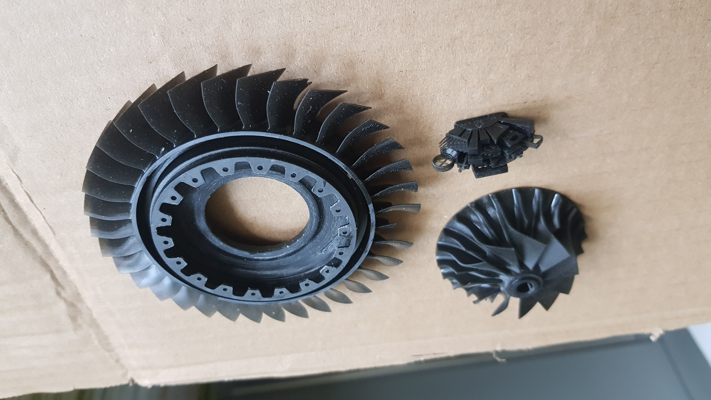

# Additive Manufacturing

## 📌 Technologies
- **FDM**
- **SLA**

## 📌 Materials
### Thermoplastics
- **PETG**
- **ABS**
- **ASA**
- **TPU**
### Resins
- **Tough Resin**
- **Rigid Resin**
- **Flexible Resin**

## 📸 Images
Exhaust adapter for SLA printer, printed in Tough Resin.

    
    

Adapter for SLA build plate. It allows to more efficient resin dripping.

Mecanum wheel prototype.

Various resins tests.

Not only engineering parts, but also just for fun!

## 📬 Contact
📧 Email: damianb.xp@gmail.com  
🐙 [GitHub](https://github.com/damianbxp)  
