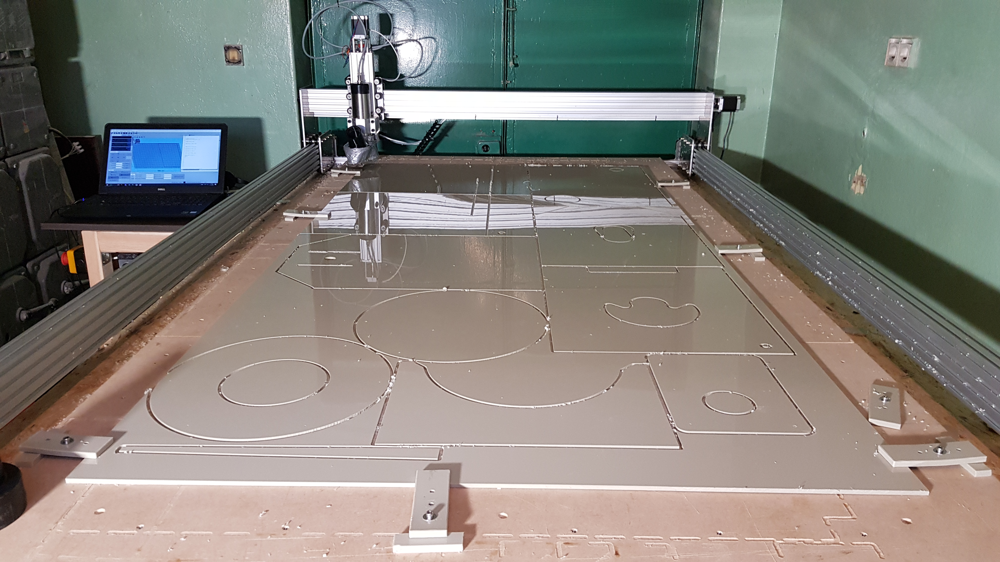
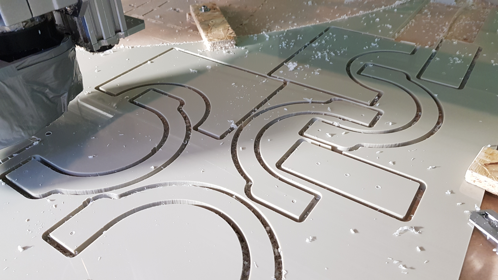
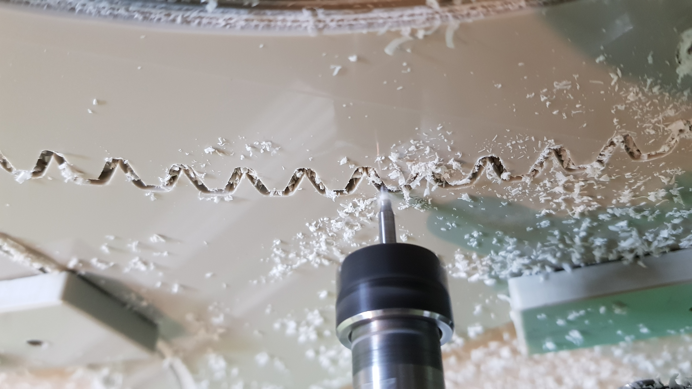
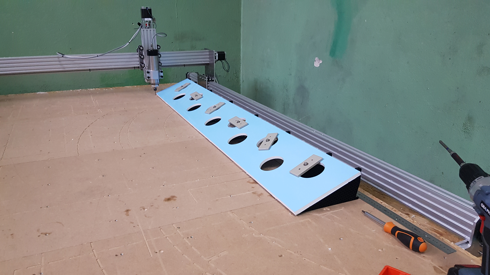
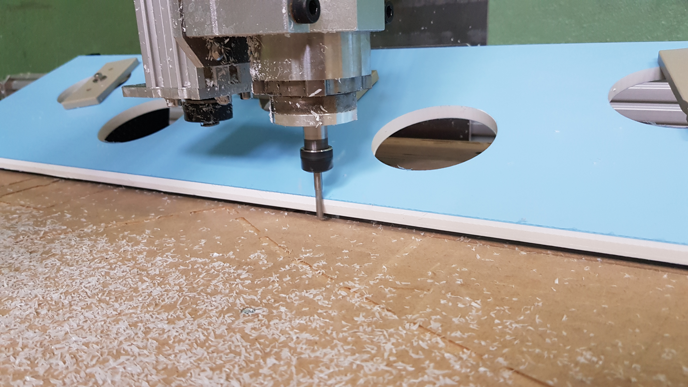

# CNC Router

## 📌 Project Overview
A low-cost **3-axis CNC router** designed for machining plastic sheets. Built using **V-slot extrusions and linear guides**, this router is powered by **NEMA 23 stepper motors** and controlled via **GRBL**.

## 🔧 Features
- **Work Area**: 1200 x 2000 mm
- **Controller**: GRBL
- **Construction**: V-slot extrusions
- **Motion System**: NEMA 23 stepper motors coupled with TR18x3 screws. V-slot system used for linear motion.

## 📸 Images

## 📬 Contact
📧 Email: damianb.xp@gmail.com  
🐙 [GitHub](https://github.com/damianbxp)  
