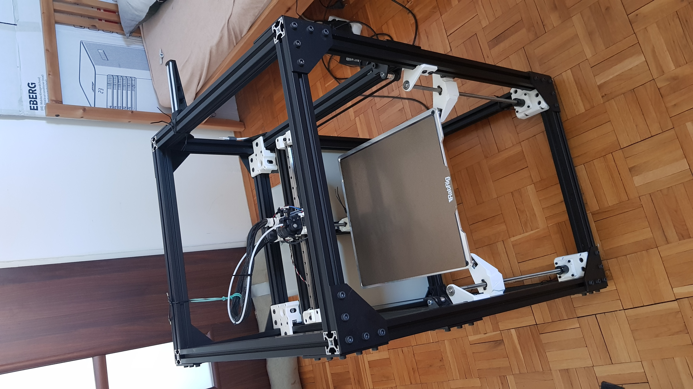
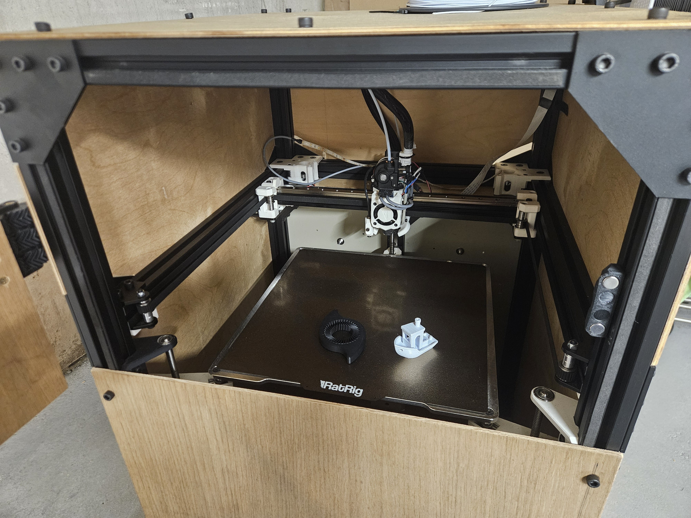
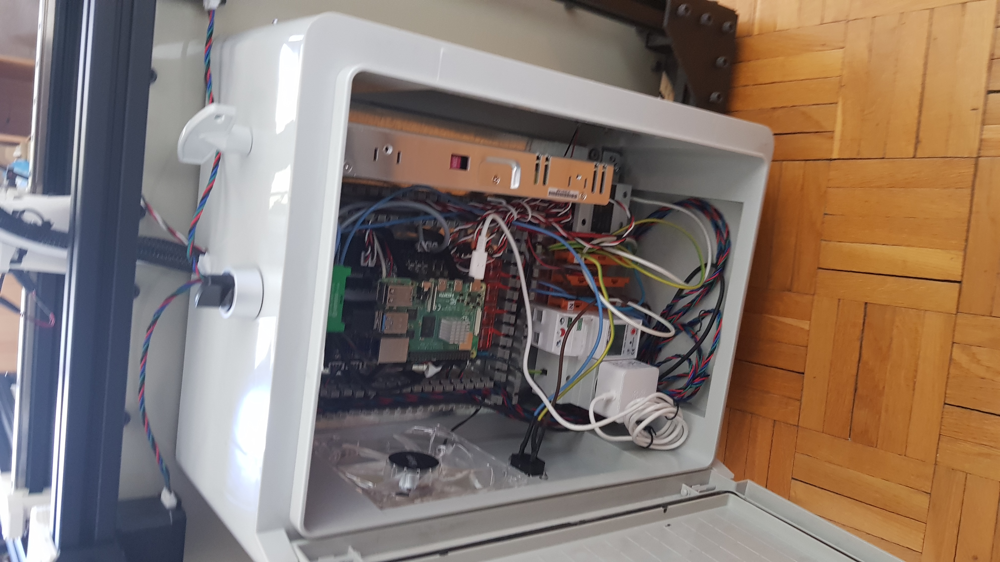

# FDM 3D Printer

## 📌 Project Overview
This is a custom-built **FDM 3D printer** inspired by the RatRig design. It utilizes **CoreXY kinematics** for high-speed and precise movement, and runs on **Klipper firmware** for enhanced control and performance.

## 🔧 Features
- **Build Volume**: 300 x 300 x 300 mm
- **Motion System**: CoreXY
- **Firmware**: Klipper
- **Bed Leveling**: Inductive probe with adaptive bed meshing
- **Future Upgrade**: Enclosure with transparent PVC panels, Camera, Additional lighting

## ⚙️ Technology Stack
- **Motherboard**: BIGTREETECH Octopus V1.1
- **Firmware**: Klipper
- **Control Interface**: Mainsail

## 📸 Images

## 🔗 Resources & References
- [Klipper Documentation](https://www.klipper3d.org/)
- [Mainsail Documentation](https://docs.mainsail.xyz/)
- [RatRig Inspiration](https://www.ratrig.com/)

## 📬 Contact
📧 Email: damianb.xp@gmail.com  
🐙 [GitHub](https://github.com/damianbxp)  
