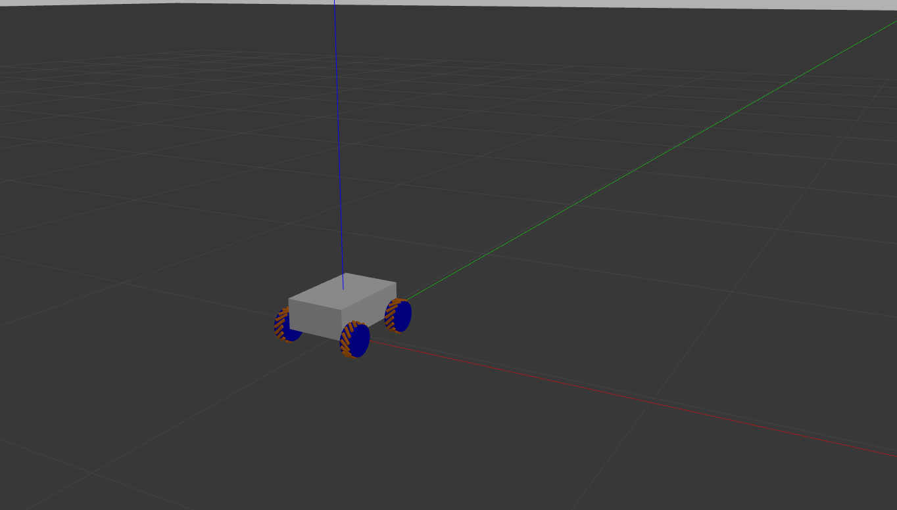
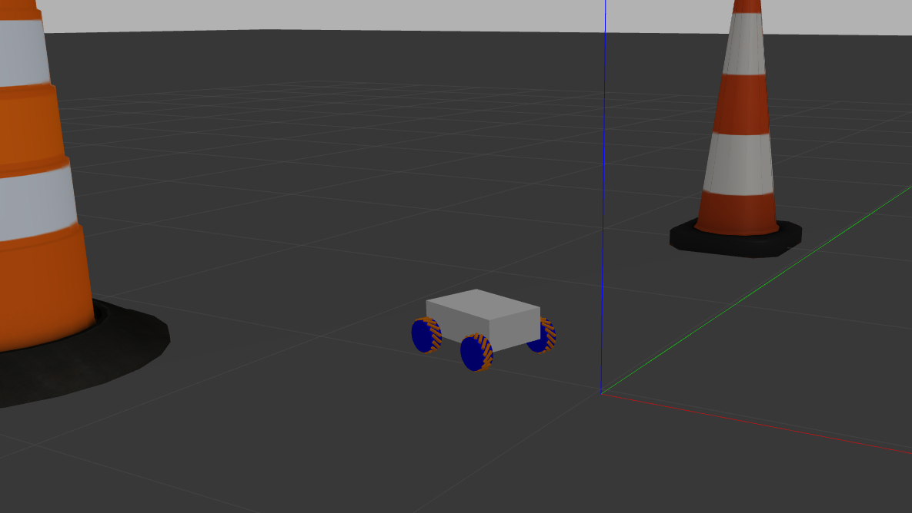

# Simulation of Omnidirectional Robotic Platform

## 📌 Project Overview
A virtual robotic platform simulated in **Gazebo**, controlled via **ROS**, and equipped with **mecanum wheels** for full omnidirectional movement. Robot can be controlled using ROS teleop keyboard or teleop joystic.

## 🔧 Features
- **Simulation Environment**: Gazebo
- **Control Framework**: ROS
- **Locomotion**: Mecanum wheels

## 📸 Images

## 🔗 Resources & References
- [Gazebo Documentation](https://gazebosim.org/)
- [ROS Documentation](https://www.ros.org/)

## 📬 Contact
📧 Email: damianb.xp@gmail.com  
🐙 [GitHub](https://github.com/damianbxp)  
