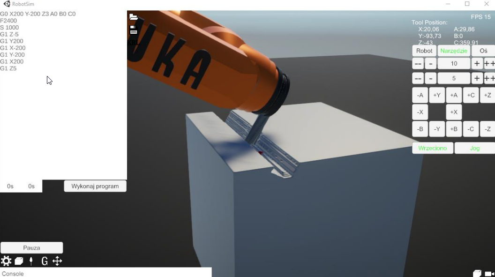
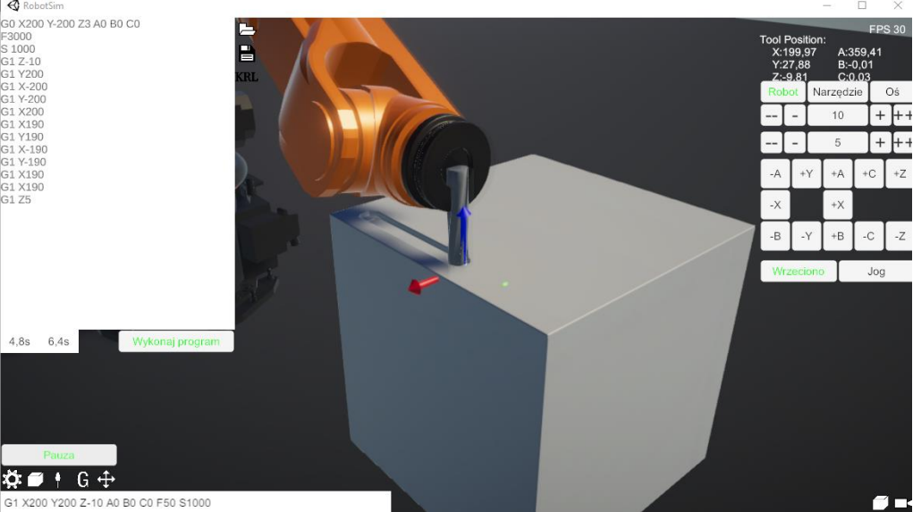

# Simulation of Machining Using Industrial Robots

## 📌 Project Overview
A **Unity-based** simulation developed as part of an **engineering degree project**. This simulator replicates **machining with an industrial robot**, specifically the **KUKA KR60 HA**. Simulator uses custom 6-axis Inverse Kinematics solver for calculating joint positions. To simulate machining operations, Marching Cubes Algorithm is used. Calculations are performed on GPU. Model is divided to chunks to improve optymization.

## 🔧 Features
- **Simulated Robot**: KUKA KR60 HA
- **Control Methods**: Executes commands via **G-code** or **KRL (KUKA Robot Language)**
- **Inverse Kinematics**: Custom-made **6-axis inverse kinematics** solver
- **Machining Simulation**: Uses **Marching Cubes algorithm** to simulate material removal.
- **Manual Jogging**: Allows real-time control of the robot

## 📸 Images

## 📬 Contact
📧 Email: damianb.xp@gmail.com  
🐙 [GitHub](https://github.com/damianbxp)  
