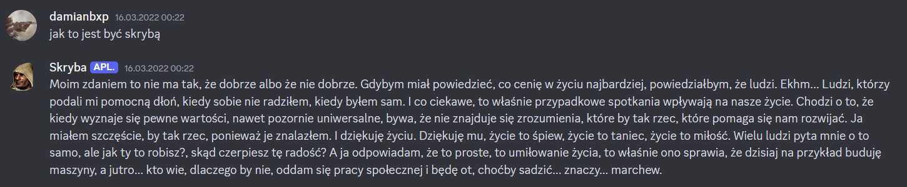
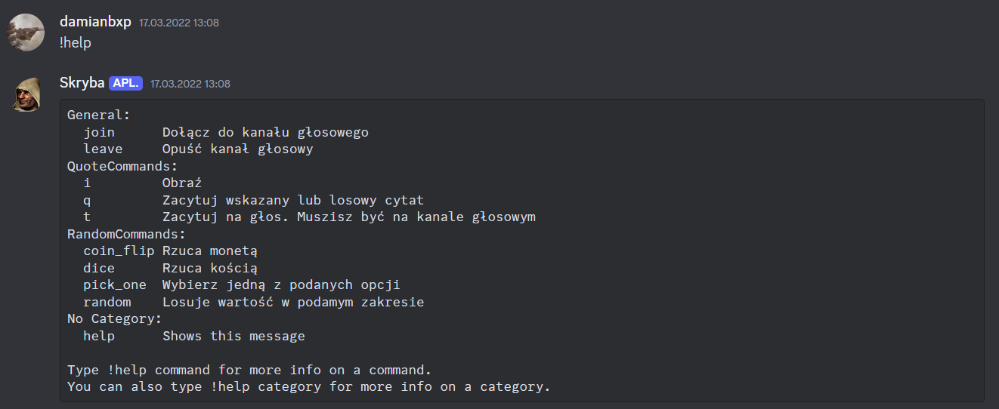

# Skryba Bot

## 📌 Project Overview
Skryba Bot is a simple Discord bot made for fun. The bot is capable of citing **predefined quotes** both in **text** and **voice**, making conversations more engaging.

## 🔧 Features
- **Quote Generation**: Sends predefined quotes in text chat
- **Discord Integration**: Seamless interaction with Discord servers
- **Customizable Responses**: Easily add new quotes to expand functionality

## 💻 Technology Stack
- **Programming Language**: Python
- **Discord API**: Uses `discord.py` for bot interactions

## 📸 Images

## 🔗 Resources & References
- [Discord API Documentation](https://discord.com/developers/docs/intro)
- [discord.py Library](https://discordpy.readthedocs.io/en/stable/)

## 📬 Contact
📧 Email: damianb.xp@gmail.com  
🐙 [GitHub](https://github.com/damianbxp)  
